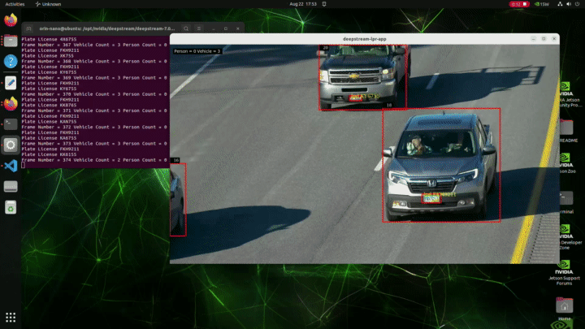

# Sample For Car License Recognization

## Description
This sample is to show how to use graded models for detection and classification with DeepStream SDK on jetson orin Nano.

`PGIE(car detection) -> SGIE(car license plate detection) -> SGIE(car license plate recognization)`


This pipeline is based on three TAO models below

* Car detection model https://ngc.nvidia.com/catalog/models/nvidia:tao:trafficcamnet
* LPD (car license plate detection) model https://ngc.nvidia.com/catalog/models/nvidia:tao:lpdnet
* LPR (car license plate recognization/text extraction) model https://ngc.nvidia.com/catalog/models/nvidia:tao:lprnet

More details for TAO3.0 LPD and LPR models and TAO training, please refer to [TAO document](https://docs.nvidia.com/tao/tao-toolkit/text/overview.html).

## Prerequisition

* [DeepStream SDK 6.0 or above](https://developer.nvidia.com/deepstream-getting-started)

  Make sure deepstream-test1 sample can run successful to verify your DeepStream installation

* [tao-converter](https://catalog.ngc.nvidia.com/orgs/nvidia/teams/tao/resources/tao-converter/version)

  Download Jetson tao-converter which is compatible to your platform from the links in https://catalog.ngc.nvidia.com/orgs/nvidia/teams/tao/resources/tao-converter/version.


## Download

1. Clone Project with SSH or HTTPS

2. Prepare Models

All models can be downloaded with the following commands:

```
    cd ANPR/
```
For US car plate recognition
```
    ./download_convert.sh us 0  
```
For Chinese car plate recognition
```
    ./download_convert.sh ch 0 
```

## Build and Run
```
    make
    cd deepstream-lpr-app
```
For US car plate recognition
```
    cp dict_us.txt dict.txt
```
For Chinese car plate recognition
```
    cp dict_ch.txt dict.txt
```

Start to run the application
```
./deepstream-lpr-app <1:US car plate model|2: Chinese car plate model> \
         <2:fakesink 3:display output> <0:ROI disable|1:ROI enable> <infer> \
         <input mp4 file name> ... <input mp4 file name> <output file name>
```

## Samples

A sample of US car plate recognition:
```
./deepstream-lpr-app 1 3 0 infer traffic1.mp4 output.264

```

## Output
The output will look like this: 

  

[Complete video](https://drive.google.com/file/d/1Ez7ULZ7ybU_frIRp-r13KTthS8eyg63L/view?usp=sharing)

