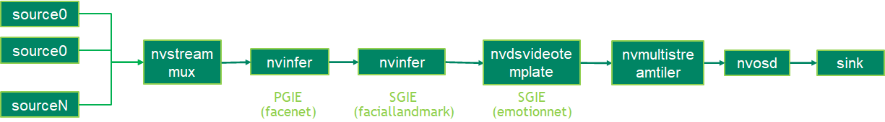

# Emotion Detection Using Deepstream on Jetson Orin Nano 8Gb
## Description
The emotion deepstream sample application identify human emotion based on the facial landmarks. Current sample application can identify five emotions as 
1. neutral
2. happy
3. surprise
4. squint
5. disgust
6. scream

## Model

The TAO pretrained models used in the sample application are:

* [Facial Landmarks Estimation](https://ngc.nvidia.com/catalog/models/nvidia:tao:fpenet)
* [FaceNet](https://ngc.nvidia.com/catalog/models/nvidia:tao:facenet)
* [EmotionNet](https://ngc.nvidia.com/catalog/models/nvidia:tao:emotionnet)

## Prerequisition

* DeepStream SDK 6.2 GA and above

## Application Pipeline
The application pipeline graph



## Download

### 1. Clone Source Code with SSH or HTTPS

```
sudo apt update
sudo apt install git-lfs
git lfs install --skip-repo
cd deepstream/emotion-detection
```
### 2. Download Models
Run below script to download models.

```
sudo ./download_models.sh 
```

## Build

### Build Sample Application

```
export CUDA_MODULE_LOADING=LAZY
export CUDA_VER=xy.z                                      // xy.z is CUDA version, e.g. 12.2
make
```
## Run

The application can be run. 

```
cd apps/tao_others/deepstream-emotion-app
export LD_LIBRARY_PATH=$LD_LIBRARY_PATH:/opt/nvidia/deepstream/deepstream/lib/cvcore_libs
./deepstream-emotion-app emotion_app_config.yml
```
* By default uri is set to webcam (v4l2:///dev/video0). It can be change from the configuration file (emotion_app_config.yml)
* If you get an error, there might be chances the engine file created won't be accessible. Therefore give access to deepstream folder using the command below and after that you can run the configuration file again
```
 sudo chmod -R 777 deepstream
```


## Output


