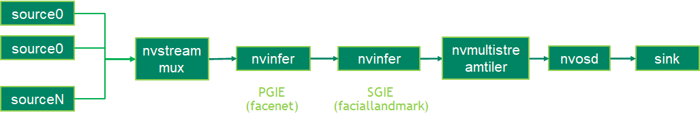
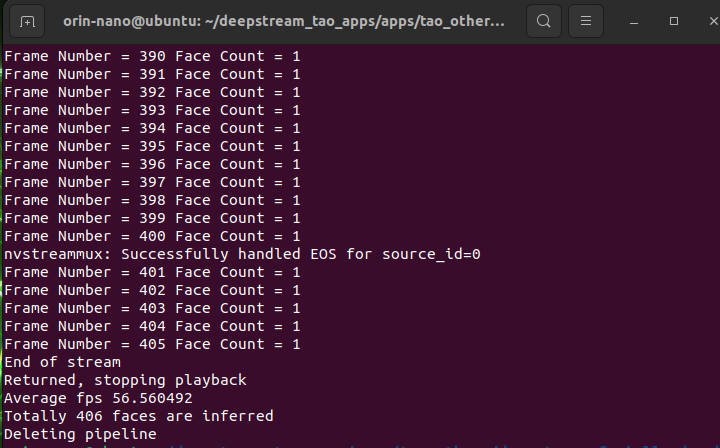

# Facial Landmark Using Deepstream on Jetson Orin Nano 8Gb
## Description
The facial landmarks estimation deepstream sample application identify landmarks in human face with face detection model and facial landmarks estimation model.
With the TAO pretrained facial landmarks estimation model, the application can idetify 80 landmarks in one human face.

## Model

The TAO 3.0 pretrained models used in this sample application:
* [Facial Landmark Estimation](https://ngc.nvidia.com/catalog/models/nvidia:tao:fpenet).
* [FaceNet](https://ngc.nvidia.com/catalog/models/nvidia:tao:facenet)

## Prerequisition

* DeepStream SDK 6.2 GA and above

## Application Pipeline
The application pipeline graph



## Download

### 1. Clone Source Code with SSH or HTTPS

```
sudo apt update
sudo apt install git-lfs
git lfs install --skip-repo
cd deepstream/facial_landmark
```
### 2. Download Models
Run below script to download models.

```
sudo ./download_models.sh 
```

## Build

### Build Sample Application

```
export CUDA_MODULE_LOADING=LAZY
export CUDA_VER=xy.z                                      // xy.z is CUDA version, e.g. 12.2
make
```
## Run

The application can be run. 

```
cd apps/tao_others/deepstream-faciallandmark-app
export LD_LIBRARY_PATH=$LD_LIBRARY_PATH:/opt/nvidia/deepstream/deepstream/lib/cvcore_libs
./deepstream-faciallandmark-app faciallandmark_app_config.yml
```
* By default uri is set to webcam (v4l2:///dev/video0). It can be change from the configuration file (faciallandmark_app_config.yml)


## Output


* FPS is 57 on Jetson Orin Nano 8Gb

 


