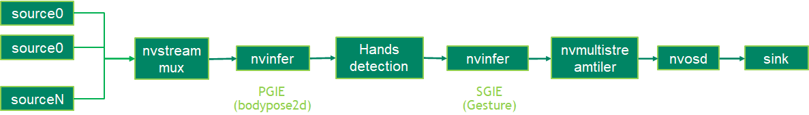

# Gesture Classification Using Deepstream on Jetson Orin Nano 8Gb
## Description
The gesture sample application uses the GestureNet model to the gesture of the hands which is identified by BodyPose model. The gesture it can classify are
1. thumbs up
2. fist
3. stop
4. ok
5. two
6. random

It uses the 2Dpose model to detect body pose as primary model and uses gesture classification model to classify the gesture as secondary model. The model can be configure to classify the gesture of right hand, left hand or both hands.

## Model

The TAO [GestureNet](https://docs.nvidia.com/tao/tao-toolkit/text/purpose_built_models/gesturenet.html) model is available in https://ngc.nvidia.com/catalog/models/nvidia:tao:gesturenet
The bodypose2D backbone is provided by TAO [bodypose 2D estimation](https://ngc.nvidia.com/catalog/models/nvidia:tao:bodyposenet). 

## Prerequisition

* DeepStream SDK 6.2 GA and above

## Application Pipeline
The application pipeline graph



## Download

### 1. Clone Source Code with SSH or HTTPS

```
sudo apt update
sudo apt install git-lfs
git lfs install --skip-repo
cd gesture-detection
```
### 2. Download Models
Run below script to download models.

```
sudo ./download_models.sh 
```

## Build

### Build Sample Application

```
export CUDA_MODULE_LOADING=LAZY
export CUDA_VER=xy.z                                      // xy.z is CUDA version, e.g. 12.2
make
```
## Run

The application can be run. 

```
cd apps/tao_others/deepstream-gesture-app
export LD_LIBRARY_PATH=$LD_LIBRARY_PATH:/opt/nvidia/deepstream/deepstream/lib/cvcore_libs
./deepstream-gesture-app gesture_app_config.yml
```
1. By default uri is set to webcam (v4l2:///dev/video0). It can be change from the configuration file (gesture_app_config.yml)
2. By default it is set to detect gesture of right hand. It can be change to left hand or both hand from the configuration file.

## Output

[complete video](https://drive.google.com/file/d/1EFxaeV9A2MbLwkoz4UC-YvcMmtAtuLRS/view?usp=sharing)

